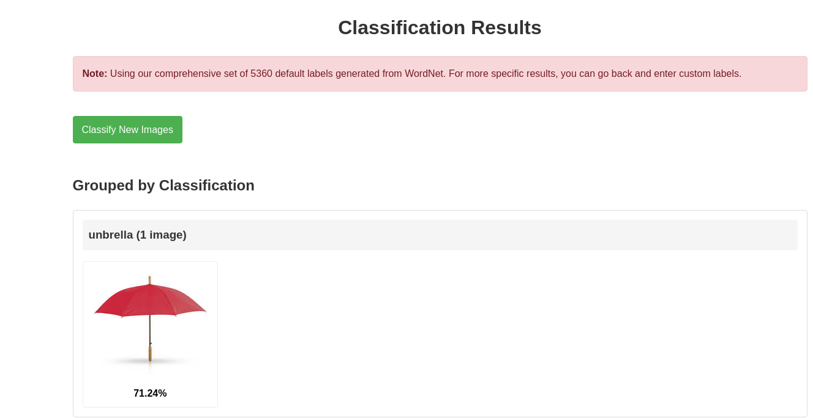

# CLIP Image Classification App

A Flask web application for classifying images using OpenAI's CLIP (Contrastive Language-Image Pre-Training) model.


## Overview

This application uses the CLIP model to classify images based on user-provided or default labels. It efficiently processes images in individual GPU batches, which allows it to handle a large number of classification labels while managing GPU memory effectively.

## Features

- Upload and classify multiple images simultaneously
- Use custom labels or automatically generated ones from WordNet (default: 6000 labels)
- Intelligent GPU/CPU memory management
- Displays classification results with confidence percentages
- Groups images by top classification category
- Optimized for handling thousands of classification labels

## Technical Implementation

- **Memory Management**: Processes each image individually on GPU, clearing memory between images
- **Batch Processing**: Handles text tokens in small batches to avoid CUDA memory issues
- **Adaptive Computing**: Automatically selects between GPU/CPU based on available resources
- **WordNet Integration**: Uses NLTK's WordNet to generate 6000 comprehensive classification labels

## Requirements

- Python 3.8+
- PyTorch
- Torchvision
- Flask
- CLIP (Contrastive Language-Image Pre-Training)
- NLTK
- PIL (Python Imaging Library)

## Installation

1. Clone the repository:
```bash
git clone https://github.com/YanivHaliwa/clip-image-classifier.git
cd clip-image-classifier
```

2. Install dependencies:
```bash
pip install -r requirements.txt
```

## Usage

1. Run the application:
```bash
python app.py
```

2. Open your browser and go to `http://localhost:5000`

3. Upload images and optionally add custom labels (comma-separated)

4. View classification results

## Docker Support

This application can be run in a Docker container with GPU support:

### Prerequisites

- Docker installed
- NVIDIA Container Toolkit (for GPU support)

### Installing NVIDIA Container Toolkit

If you haven't installed the NVIDIA Container Toolkit yet (required for GPU support):

```bash
# Add the NVIDIA Container Toolkit repository
distribution=$(. /etc/os-release;echo $ID$VERSION_ID)
curl -s -L https://nvidia.github.io/libnvidia-container/gpgkey | sudo apt-key add -
curl -s -L https://nvidia.github.io/libnvidia-container/$distribution/libnvidia-container.list | sudo tee /etc/apt/sources.list.d/nvidia-container-toolkit.list

# Update apt and install nvidia-container-toolkit
sudo apt-get update
sudo apt-get install -y nvidia-container-toolkit

# Restart Docker
sudo systemctl restart docker
```

### Building the Docker Image

Build the Docker image from the project directory:

```bash
docker build -t clip-image-classifier .
```

### Running with GPU Support

Run the container with GPU support:

```bash
docker run --gpus all -p 5000:5000 -v $(pwd)/static/uploads:/app/static/uploads clip-image-classifier
```

### Running with Docker Compose

Alternatively, use docker-compose:

```bash
docker-compose up
```

### Troubleshooting GPU Support

If you encounter issues with GPU support:

1. Check NVIDIA runtime availability:
```bash
docker info | grep -i runtime
```

2. Try the older syntax if needed:
```bash
docker run --runtime=nvidia -p 5000:5000 -v $(pwd)/static/uploads:/app/static/uploads clip-image-classifier
```

3. If you still have issues, check your NVIDIA driver installation:
```bash
nvidia-smi
```

## Memory Optimization

This application features advanced memory management to handle large sets of classification labels:

- Cleans GPU memory between images with `torch.cuda.empty_cache()`
- Uses configuration to reduce memory fragmentation
- Implements intelligent fallback to CPU when GPU memory is constrained

## Screenshots


*Main interface for uploading images and entering classification labels*


*Classification results showing confidence scores and image grouping*

## License

MIT License

## Author

Created by [Yaniv Haliwa](https://github.com/YanivHaliwa) for security testing and educational purposes.
